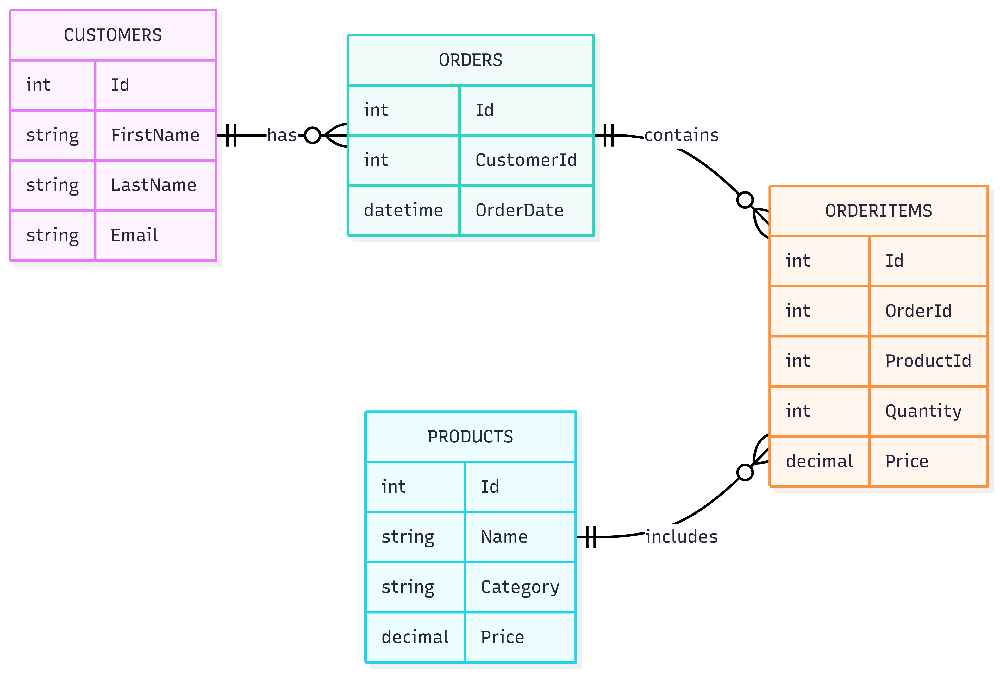

# ERPApp

ERPApp is a simple demo project representing the core data model of a basic sales system (ERP-style).  
It is used for testing Entity Framework Core, LINQ queries, seeding test data, and generating reports.

## Entities

- `Customers`: Clients placing orders
- `Products`: Items available in the store
- `Orders`: Placed orders
- `OrderItems`: Products in an order, with quantity and price

## Entity Relationship Diagram

Below is the visual structure of the application's data model:

